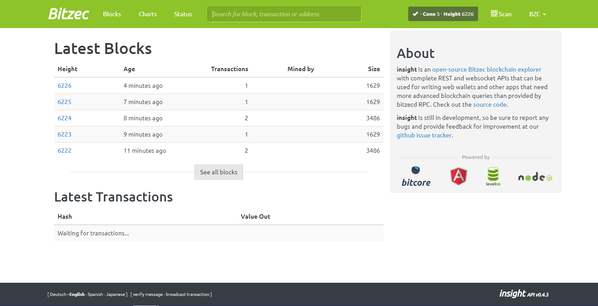

BITZEC 1.1.6

===========

[Bitzec](http://bitzec.org) is a fork of
[Zcash] and  (https://z.cash/) is an implementation of the "Zerocash" protocol.
Based on Nakamotos Bitcoin code.
What is [Bitcoin](https://en.wikipedia.org/wiki/Bitcoin) ?
What are [Zero knowledge proofs](https://zkp.science) ?
--------------
Bitzec  (http://bitzec.org/) is a fork of 
[Zcash 2.0](https://z.cash/)  with its own genesis block , it is an implementation of the "Zerocash" protocol.
Based on Nakamotos Bitcoin code, it intends to offer a higher standard of privacy
through a sophisticated zero-knowledge proving scheme that preserves
confidentiality of transaction metadata. Technical details are available
in our [Protocol Specification](https://github.com/zcash/zips/raw/master/protocol/protocol.pdf).

This software is the Bitzec client. It downloads and stores the entire history
of Bitzec transactions.


<p align="center">

</p>

#### :lock: documentation ()

[Dokumentation 1.1.2] (https://github.com/bitzec/bitzec-patched-account-labeling/blob/master/Bitzec%20Documentation%201.1.2.pdf Documentation 1.1.2.pdf)

**Bitzec is experimental and a work-in-progress.** Use at your own risk.

```{r, engine='bash'}
Install dependencies:

sudo apt-get install \
build-essential pkg-config libc6-dev m4 g++-multilib \
autoconf libtool ncurses-dev unzip git python python-zmq \
zlib1g-dev wget curl bsdmainutils automake

Clone Bitzec Repository :

git clone https://github.com/bitzec/bitzec.git


cd bitzec/
./zcutil/build.sh --disable-tests -j$(nproc)


./zcutil/fetch-params.sh
mkdir -p ~/.bitzec

echo "addnode=bzcseed.raptorpool.org" >~/.bitzec/bitzec.conf
echo "genproclimit=0" >> ~/.bitzec/bitzec.conf
echo 'equihashsolver=tromp' >> ~/.bitzec/bitzec.conf

Run It :

./src/bitzecd
./src/bitzec-cli getblockchaininfo


./bitzec-cli help      <--- for full command list 
open debug.log under ctrl+h hidden folder .bitzec/debug.log

windows crosscompile on Debian / Ubuntu: 
 sudo apt install mingw-w64
 sudo update-alternatives --config x86_64-w64-mingw32-gcc
     (configure 1 to use POSIX variant)
 sudo update-alternatives --config x86_64-w64-mingw32-g++
     (configure 1 to use POSIX variant)
 HOST=x86_64-w64-mingw32 ./zcutil/build.sh
 you will get src/bitzec-cli.exe src/bitzecd.exe src/zcash-gtest.exe src/bitzec-tx.exe
in case you compiled for ubuntu before on same folder bitzec   ( make clean && make -C src/univalue clean )
```
Installation video :https://youtu.be/5ahQZZYcntQ


### START TESTING

Add unit tests for Bitzec under Bitzec  ./src/gtest.

To list all tests, run ./src/zcash-gtest --gtest_list_tests.

To run a subset of tests, use a regular expression with the flag --gtest_filter. Example:

` ./src/zcash-gtest --gtest_filter=DeprecationTest.* `

For debugging: --gtest_break_on_failure.

To run a subset of BOOST tests: ` src/test/test_bitcoin -t TESTGROUP/TESTNAME


https://zcash.readthedocs.io/en/latest/rtd_pages/development_guidelines.html#development-guidelines


####  :ledger: No Deprecation Policy

## Getting Started

Please see our [user guide](https://zcash.readthedocs.io/en/latest/rtd_pages/rtd_docs/user_guide.html) for joining the main Bitzec network.

### Need Help?

* :blue_book: See the zcash documentation at the [ReadtheDocs](https://zcash.readthedocs.io)
  for help and more information or 
  (https://github.com/bitzec/bitzec-patched-account-labeling/blob/master/Bitzec%20Documentation%201.1.2.pdf


### Building

Build Bitzec along with most dependencies from source by running:

```
./zcutil/build.sh -j$(nproc)
or 
./zcutil/build.sh --disable-tests -j$(nproc)
```

for local insight  blockexplorer 
visit https://github.com/bitzec/insight-ui-bitzec

online http://explorer.bitzec.org

  
<p align="center">
  
</p>


BLOCKREWARD DECREAS PLAN
<p align="center">
  
  
  
  
License
-------

For license information see the file [COPYING](COPYING).

<p align="center">
  
  <p align="center">
  
  
